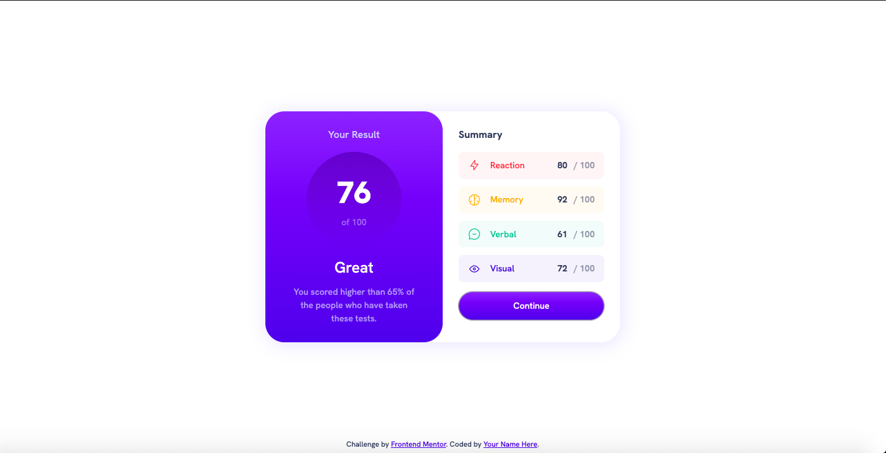

# Frontend-Mentor-Results-summary-component
A solution submitted for Frontend Mentor's results summary component challenge. 

# Frontend Mentor - Results summary component solution

This is a solution to the [Results summary component challenge on Frontend Mentor](https://www.frontendmentor.io/challenges/results-summary-component-CE_K6s0maV). Frontend Mentor challenges help you improve your coding skills by building realistic projects. 

## Table of contents

- [Overview](#overview)
  - [The challenge](#the-challenge)
  - [Screenshot](#screenshot)
  - [Links](#links)
- [My process](#my-process)
  - [Built with](#built-with)
  - [What I learned](#what-i-learned)
  - [Continued development](#continued-development)
  - [Useful resources](#useful-resources)
- [Author](#author)

**Note: Delete this note and update the table of contents based on what sections you keep.**

## Overview

### The challenge

Users should be able to:

- View the optimal layout for the interface depending on their device's screen size
- See hover and focus states for all interactive elements on the page

### Screenshot

### Links

- Solution URL: (https://github.com/ClemenceTafforeau/Frontend-Mentor-Results-summary-component)
- Live Site URL: (https://clemencetafforeau.github.io/Frontend-Mentor-Results-summary-component/))

## My process

### Built with

- Semantic HTML5 markup
- CSS custom properties
- Flexbox
- Mobile-first workflow

### What I learned

How to make elements more responsive. 

### Continued development

I didn't use Grid in this project but, after watching Kevin Powell's video about this challenge, I can see how it could be applied. I will try to implement in my next project (if its use is warranted). I would also like to use data attributes instead of creating more class selectors. 

### Useful resources

- [Kevin Powell's submission to the challenge]([https://www.example.com](https://www.youtube.com/watch?v=KqFAs5d3Yl8)) - i watched this video after my own attempt in order to identify what I could have done differently. It helped me find out about methods that could have prevented a few difficulties that I encountered during this project.

## Author

- Frontend Mentor - [@ClemenceTafforeau]([https://www.frontendmentor.io/profile/yourusername](https://www.frontendmentor.io/profile/ClemenceTafforeau))
